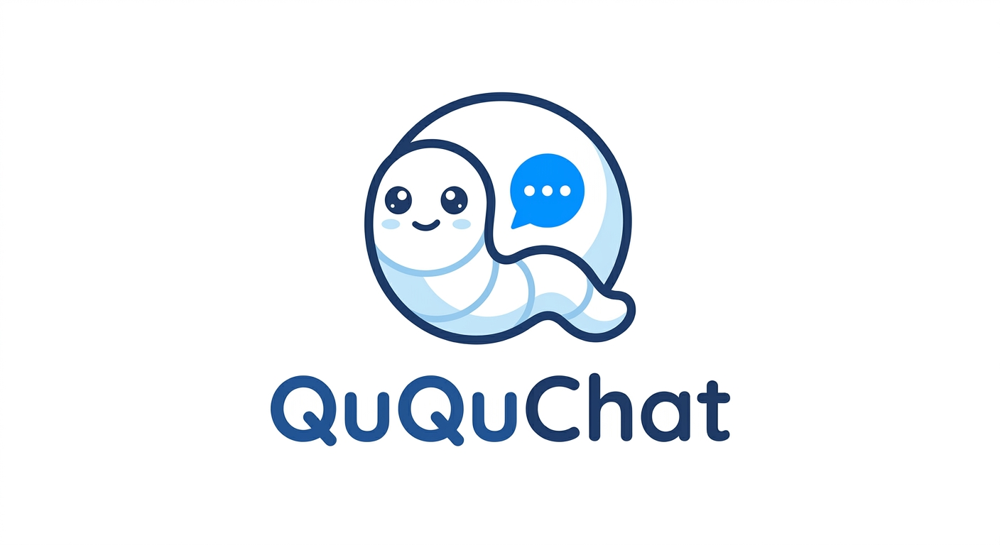

# QuQuChat

<p align="center">
  
</p>

QuQuChat 是一个聊天系统项目，包含：
- Go 后端 API 服务（`cmd/main.go`）
- Go 异步任务服务（`cmd/taskservice/main.go`）
- Electron + React 前端（`frontend`）
- PostgreSQL / Redis / RabbitMQ / Qdrant / MinIO 等依赖

## 1. 启动方式推荐（Docker Compose）

这是最稳妥的方式，会一次性拉起基础设施 + API + TaskService。

### 1.1 准备环境变量

项目根目录已提供 `.env` 文件，请按需填充：

### 1.2 生成配置文件

在项目根目录执行，将模板复制到 `internal/config/config.yaml` 后再按需填写：

```bash
cp internal/config/config.template.yaml internal/config/config.yaml
```

### 1.3 启动

在项目根目录执行：

```bash
docker compose up -d --build
```

### 1.4 检查服务

- API 健康检查：`http://localhost:8080/`
- RabbitMQ 管理台：`http://localhost:15672`
- MinIO Console：`http://localhost:9001`
- Qdrant HTTP：`http://localhost:6333`

查看日志：

```bash
docker compose logs -f ququchat-api ququchat-taskservice
```

停止服务：

```bash
docker compose down
```

## 2. 本地开发启动（不走容器内 API/TaskService）

适合本地调试 Go 代码。注意：配置默认从 `internal/config/config.yaml` 读取，且路径依赖当前工作目录，必须在项目根目录执行命令。

### 2.1 先启动基础依赖

只启动中间件：

```bash
docker compose up -d postgres redis rabbitmq qdrant minio
```

### 2.2 调整配置

`internal/config/config.yaml` 默认使用容器网络地址（如 `postgres`、`redis`、`rabbitmq`），如果你在宿主机运行 Go 程序，通常要改成 `localhost` 对应端口。

### 2.3 启动 API 服务

```bash
go run ./cmd
```

API 默认监听 `:8080`。

### 2.4 启动 TaskService

另开一个终端：

```bash
go run ./cmd/taskservice
```

## 3. 前端启动（Electron）

前端目录：`frontend`，默认后端地址为 `http://localhost:8080/api`。

```bash
cd frontend
npm install
npm run dev
```

如需 Electron 方式：

```bash
cd frontend
npm install
npm run electron
```

## 4. 常见问题

- API 启动即退出：优先检查数据库连接、对象存储配置（`storage.provider` 与对应 `minio/oss` 参数）。
- 任务不消费：确认 `taskservice` 进程已运行，且 RabbitMQ 可访问。
- RAG 相关失败：确认 Qdrant 可访问，`vector` 配置正确。
- LLM/AIGC/Embedding 报错：确认对应 API Key 已注入环境变量并在配置中生效。

## 5. 关键入口

- API 入口：`cmd/main.go`
- TaskService 入口：`cmd/taskservice/main.go`
- 配置文件：`internal/config/config.yaml`
- 容器编排：`docker-compose.yml`
